# MyFightingGame

> 一款使用 Unity 2D 开发的俯视角 Roguelike 动作游戏。在持续刷新的敌人浪潮中战斗，获取经验、解锁技能、收集装备，并挑战更高分数。

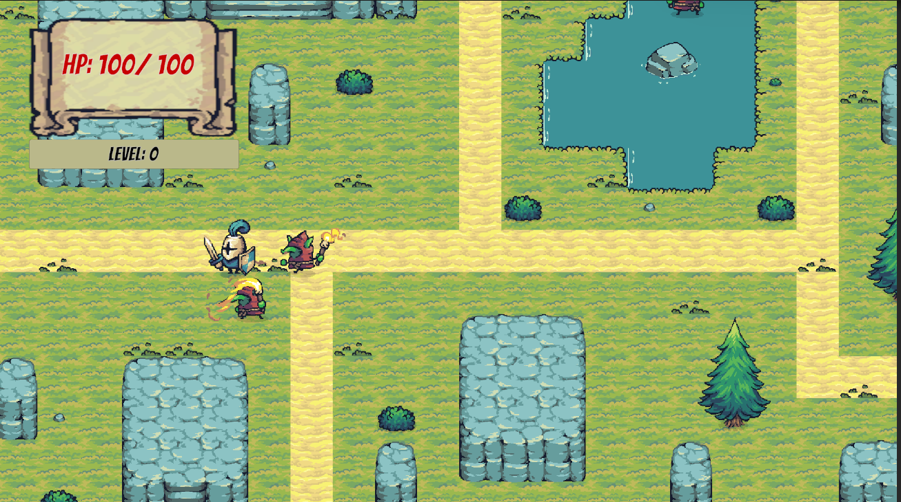

## 游戏特色

- **即时战斗**：支持八方向移动、近战斩击、弓箭射击和武器切换。
- **波次挑战**：普通敌人按波次生成，每隔指定波次出现 Boss。
- **成长构筑**：击败敌人获得经验，升级后取得技能点并逐步解锁能力。
- **随机掉落**：敌人概率掉落道具，拾取后直接提升攻击、生命或移动速度。
- **探索场景**：基于 Tilemap 构建地图，并通过碰撞层与渲染层实现高低差区域。
- **像素风格**：使用 Tiny Swords 美术资源，搭配卷轴式 UI 和俯视角战斗场景。

## 游戏截图

### 开始界面

开始游戏、查看最高分与操作提示，也可以直接退出游戏。

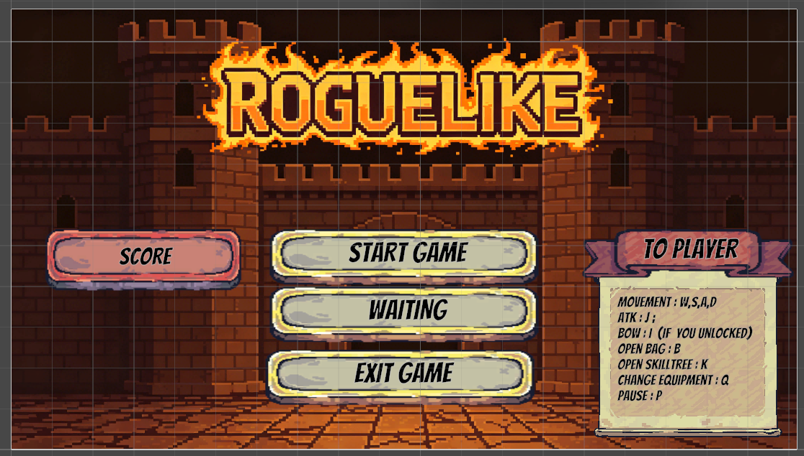

### 地图选择

当前开放第一张战斗地图，其余入口作为后续关卡的扩展位置。

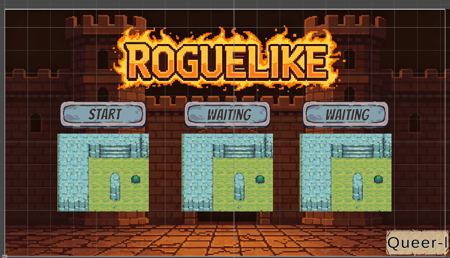

### 战斗场景

左上角实时显示生命值与等级；敌人会感知、追击并攻击玩家。


### 背包与技能树

<table>
  <tr>
    <td width="50%">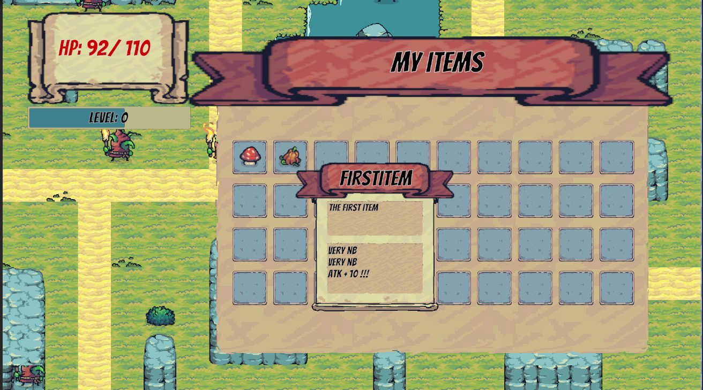</td>
    <td width="50%">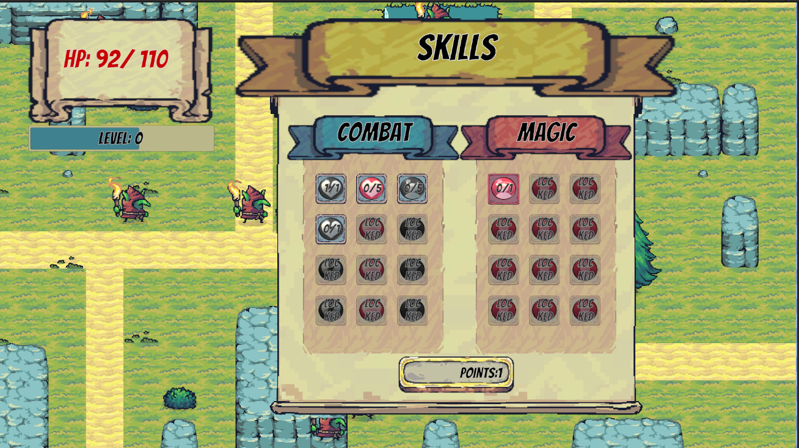</td>
  </tr>
  <tr>
    <td align="center">背包：查看已拾取道具及属性说明</td>
    <td align="center">技能树：消耗技能点解锁战斗与能力节点</td>
  </tr>
</table>

## 操作方式

| 按键 | 功能 | 说明 |
| --- | --- | --- |
| `W` / `A` / `S` / `D` | 移动 | 八方向移动 |
| `J` | 近战斩击 | 需要已解锁近战能力 |
| `I` | 弓箭射击 | 需要先解锁 Bow 技能 |
| `Q` | 切换武器 | 在近战与远程武器间切换 |
| `B` | 背包 | 打开或关闭背包，打开时暂停战斗 |
| `K` | 技能树 | 打开或关闭技能树，打开时暂停战斗 |
| `P` | 状态/暂停面板 | 打开或关闭面板，打开时暂停战斗 |
| `Enter` | 增加经验 | 开发调试按键 |

## 核心玩法

1. 从开始界面进入地图选择，并选择已开放的战斗地图。
2. 使用近战攻击迎击敌人，在解锁弓箭后切换为远程输出。
3. 击败敌人获得分数和经验，并有概率生成道具掉落。
4. 拾取道具强化基础属性；升级后使用技能点解锁新能力。
5. 应对持续增加的敌人波次与周期性 Boss，挑战历史最高分。

## 系统架构

### 总体分层

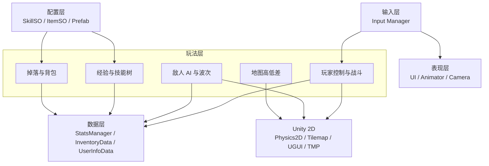

### 场景流转

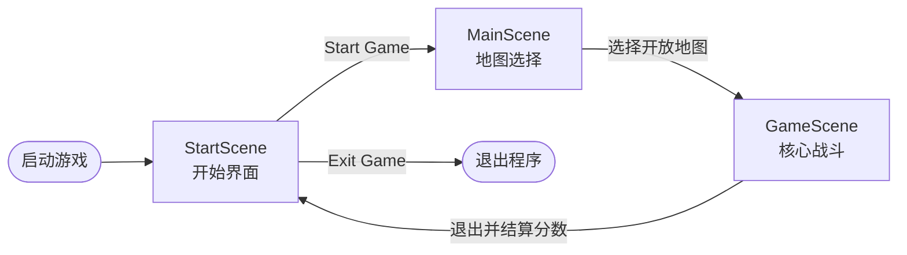

### 核心战斗循环

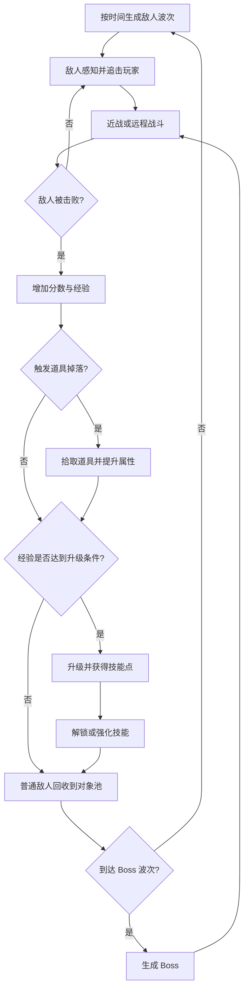

### 敌人 AI 状态机

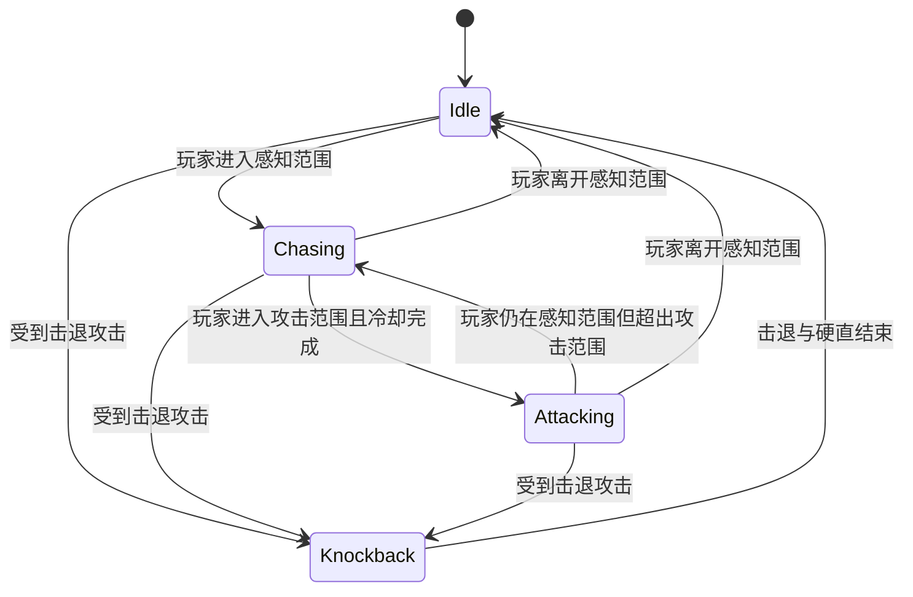

### 事件与数据流

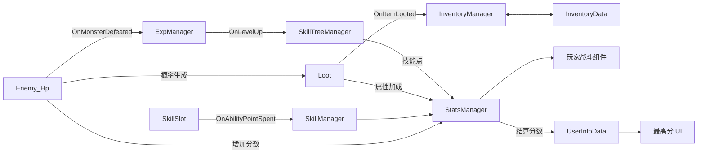

### 数据驱动关系

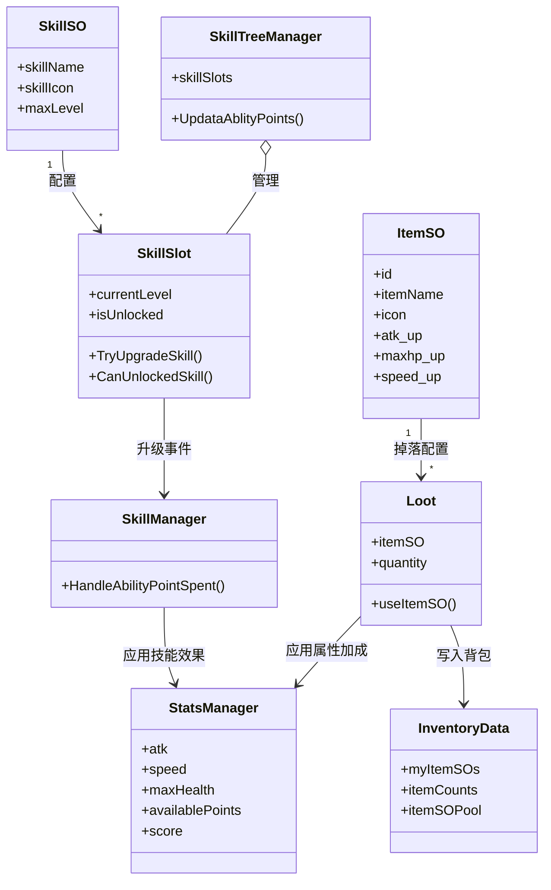

## 核心系统说明

### 玩家与战斗

- `PlayerMove` 读取移动输入并驱动 `Rigidbody2D` 与角色动画。
- `Player_Combat` 使用范围检测完成近战伤害和击退。
- `Player_Bow` 生成箭矢，箭矢命中敌人后造成伤害与击退。
- `Player_ChangeEquipment` 根据技能解锁状态切换近战与远程组件。
- `StatsManager` 集中维护攻击、速度、生命、击退、技能点和分数等运行时属性。

### 敌人与波次

- `EnemySpawner_2D` 以玩家为中心，在安全距离外按时间生成敌人。
- 普通敌人使用对象池复用；池满时销毁，降低频繁实例化带来的开销。
- `Enemy_Movement` 维护待机、追击、攻击与击退状态。
- `Enemy_Hp` 在敌人死亡时广播经验事件、累计分数并尝试生成掉落物。
- 每隔 `bossWaveInterval` 波生成 Boss，具体间隔可在 Inspector 中调整。

### 经验与技能树

- 敌人死亡事件由 `ExpManager` 订阅，经验达到阈值后提升等级。
- 每次升级通过事件向 `SkillTreeManager` 发放技能点。
- 技能节点使用 `SkillSO` 保存图标、名称和最大等级等配置。
- 前置节点达到最高等级后，后续节点自动解锁。
- 当前实现包含最大生命、近战、弓箭、攻击提升和吸血等效果。

### 道具与背包

- `ItemSO` 定义道具名称、图标、描述和属性增益。
- 敌人死亡后从道具池随机选择掉落内容，并实例化 `Loot`。
- 玩家拾取时触发事件，`InventoryManager` 更新背包槽位。
- 道具增益写入 `StatsManager`，用于实时改变玩家战斗属性。

### UI 与场景数据

- UGUI 与 TextMesh Pro 显示生命、等级、经验、背包、技能和分数。
- 背包、技能树和状态面板打开时将 `Time.timeScale` 设为 `0` 暂停战斗。
- `UserInfoData` 使用 `DontDestroyOnLoad` 在场景切换间保留本次运行的最高分。
- `InventoryData` 维护当前运行中的道具集合与背包状态。

## 项目结构

```text
MyFightingGame/
├── Assets/
│   ├── AIGC/Enemy/              # 波次生成与编辑辅助脚本
│   ├── Prefabs/                 # 敌人、Boss、箭矢、道具和 UI 预制体
│   ├── Scenes/                  # StartScene / MainScene / GameScene
│   ├── Scripts/
│   │   ├── Player/              # 移动、战斗、生命、经验与属性
│   │   ├── Enemy/               # AI、攻击、生命与击退
│   │   ├── SkillTree/           # 技能数据、节点、效果与 UI
│   │   ├── Item/                # 道具数据、掉落、背包与槽位
│   │   ├── UI/                  # 菜单、面板与最高分显示
│   │   ├── Elevation/           # 高低差碰撞与渲染层切换
│   │   └── User/                # 跨场景用户数据
│   ├── Sprites/                 # 角色、敌人、地图与 UI 素材
│   └── TextMesh Pro/            # TMP 资源
├── GAME/                        # Windows 可执行版本
├── Packages/                    # Unity 包依赖
├── ProjectSettings/             # Unity 项目配置
└── 游戏信息/                    # README 展示截图
```

## 技术栈

| 类别 | 技术 |
| --- | --- |
| 引擎 | Unity / Tuanjie Editor `2022.3.62t16`（Tuanjie `1.10.4`） |
| 语言 | C# |
| 渲染与地图 | Unity 2D、SpriteRenderer、Tilemap |
| 物理 | Rigidbody2D、Collider2D、Physics2D |
| UI | UGUI、TextMesh Pro `3.0.9` |
| 镜头 | Cinemachine `2.10.6` |
| 数据配置 | ScriptableObject |
| 代码组织 | 单例、事件驱动、状态机、对象池、协程 |

## 快速开始

### 直接运行

Windows 用户可以运行：

```text
GAME/Luna.exe
```

请保留 `Luna.exe`、`Luna_Data`、`MonoBleedingEdge` 和相关 DLL 的原有目录结构。

### 在编辑器中运行

1. 使用 Tuanjie Editor `2022.3.62t16` / `1.10.4`，或兼容的 Unity 2022.3 LTS 编辑器打开仓库根目录。
2. 等待 Package Manager 完成依赖解析与资源导入。
3. 确认 Build Settings 中的场景顺序为：
   - `Assets/Scenes/StartScene.scene`
   - `Assets/Scenes/MainScene.scene`
   - `Assets/Scenes/GameScene.scene`
4. 打开 `StartScene`，点击 Play 开始游戏。

## 关键配置

- `Player` 使用 Layer `6`。
- `Enemy` 使用 Layer `7`。
- 技能和道具通过对应的 ScriptableObject 资源配置。
- 敌人数量、生成间隔、生成半径、对象池上限和 Boss 波次可在 `EnemySpawner_2D` 的 Inspector 中调整。
- 输入映射保存在 `ProjectSettings/InputManager.asset`。

## 开发路线

- [x] 玩家移动、近战与远程战斗
- [x] 敌人 AI、击退与对象池
- [x] 敌人波次与 Boss
- [x] 经验、等级与技能点
- [x] 技能树及前置节点
- [x] 道具掉落与背包 UI
- [x] 场景高低差与渲染层切换
- [x] 分数与运行期最高分
- [ ] 增加更多地图与敌人类型
- [ ] 扩充技能分支与道具组合
- [ ] 完善音效、背景音乐和反馈表现
- [ ] 增加本地存档与跨运行记录

## 版本记录

| 版本 | 内容 |
| --- | --- |
| `v0.4` | 加入 Boss 预制体与周期性 Boss 波次 |
| `v0.3` | 加入敌人掉落，修复场景切换时间缩放问题并优化战斗手感 |
| `v0.2` | 修复多项问题并提供 Windows 可执行版本 |
| `v0.1` | 完成移动、战斗、敌人、技能树、背包和经验等级等基础系统 |

## 资源说明

- 主要像素美术资源来自 **Tiny Swords** 素材包。
- 项目许可证见 [LICENSE](LICENSE)。

---

Made with Unity 2D.
